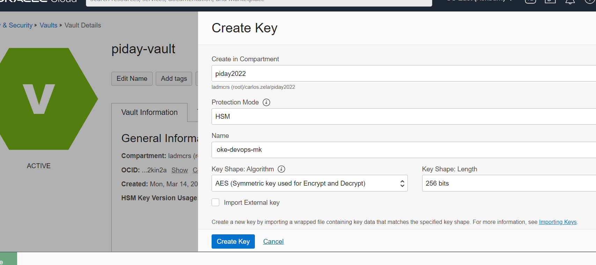

# OCI Tour Grand Prix MCR Sur, Qualy- Laboratorio para desplegar un microservicio en python en Oracle Kubernetes Engine (OKE) usando estrategias avanzadas de despliegue con OCI DevOps

[](https://img.shields.io/badge/license-UPL-green) [](https://sonarcloud.io/dashboard?id=oracle-devrel_python-oci-canary-oke-app)

Objetivos
---
- Crear un proyecto en OCI DevOps.
- Crear un repositorio de codigo Git con la aplicacion python en OCI DevOps.
- Crear un pipeline de construccion en OCI DevOps.
- Entregar los artefactos (container image y kube yaml) en OCI Container Registry y OCI Artifact.
- Crear 2 estrategias de despliegue de la aplicacion python (Canary y normal) en OCI DevOps.
- Aprovisionar un cluster OKE e instalar Nginx Ingress Controller.
- Desplegar la aplicacion python en OKE usando cada estrategia de despliegue.
- Validar y revertir los cambios.

Setup Lab
---
- Crear un compartment con el nombre de 'qualy.oke.devops'
- Crear un Grupo llamado 'devops-admins' y agregarse el grupo.
- Crear los permisos y accesos en IAM para ejecutar el lab
    - Crear un OCI IAM Dynamic Group llamado 'DevOpsDynamicGroup'
    ```
    ALL {resource.type = 'devopsbuildpipeline', resource.compartment.id = 'ocid1.compartment.oc1..xxx'}	
    ALL {resource.type = 'devopsrepository', resource.compartment.id = 'ocid1.compartment.oc1..xxx'}	
    ALL {resource.type = 'devopsdeploypipeline', resource.compartment.id = 'ocid1.compartment.oc1..xxx'}	
    ALL {resource.type = 'devopsconnection', resource.compartment.id = 'ocid1.compartment.oc1..xxx'}
    ```
    - Crear OCI IAM Policies
    ```
    Allow group devops-admins to manage all-resources in compartment qualy.oke.devops
    Allow dynamic-group DevOpsDynamicGroup to manage all-resources in compartment qualy.oke.devops
    ```
    > Para un entorno real o productivo se deberia acotar los permisos a recursos especificos con verbos y accesos especificos.

- Validar auth en OCI CLI desde el Cloud Shell
```
oci iam user get --user-id ocid1.user.oc1..xxx
```
- Validar git bash desde el Cloud Shell
```
git version
```
Lab
---
- ### Crea el cluster de OKE
    - Crear un nuevo OKE (Con public endpoint y public o private workers) - https://docs.oracle.com/en-us/iaas/Content/ContEng/home.htm . 
    
    

    Usa la opcion `Access cluster` para configurar tu acceso a `OKE` desde el Cloud Shell.
    

- ### Crea un topico en OCI Notification
    - Crear un nuevo topico en OCI Notification - https://docs.oracle.com/en-us/iaas/Content/Notification/Tasks/managingtopicsandsubscriptions.htm .
    

- ### Crea el proyecto en OCI DevOps
    - Crea un proyecto en OCI DevOps llamado `DevOps-GrandPrix2022` - https://docs.oracle.com/en-us/iaas/Content/devops/using/home.htm.
    

- ### Crea un repositorio en OCI Container Registry
    - Crea un OCI container registry en el compartment del Lab. https://docs.oracle.com/en-us/iaas/Content/Registry/home.htm
    

- ### Crea un repositorio en OCI Artifact Registry
    - Crea un OCI artifact registry . https://docs.oracle.com/en-us/iaas/Content/artifacts/home.htm
    

- ### Crea el OCI Vault y agregamos 2 secretos:
    - Crea el OCI Key Vault
    
    - Crea el Master Key en el OCI Key Vault
    
    - Crea los 2 secretos en el OCI Key Vault
    
    ```
    OCIR_HOST_VAULT=iad.ocir.io (si esta en la region de Ashburn)
    OCIR_STORAGE_NAMESPACE_VAULT= <Container Registry namespace>
    ```
- ### Descarga el codigo de la aplicacion python y subelo al repositorio en OCI Devops
```
git clone https://github.com/czelabueno/python-oci-canary-oke-app.git
cd python-oci-canary-oke-app
git config user.email "<tu email>"
git config user.name "<tu nombre>"
git remote add oci-devops ssh://devops.scmservice.xxxx
git remote
git remote remove origin
git pull --no-edit --allow-unrelated-histories oci-devops main
git push oci-devops main
```
- ### Asociamos los artefactos a generar en OCI DevOps
    - Artifactos en OCI DevOps . - https://docs.oracle.com/en-us/iaas/Content/devops/using/artifacts.htm
    - Crea un artefacto tipo Docker `Docker image` para subir el artefacto en el `Delivery`. Asegúrese de usar la URL de su `container repo`, con el prefijo de `${OCIR_HOST}/${OCIR_STORAGE_NAMESPACE}` y `${BUILDRUN_HASH}` al final de la URL. Esto es para hacer que la versión de la imagen de la ventana acoplable sea dinámica.
    
    - Crea un artefacto de tipo `Kubernetes manifest`. Asegurate de agregar tu ruta de `artifact repo`y  la version como `${BUILDRUN_HASH}` .
    
    
- ### Crea el Build y Deployment Pipeline para el CI/CD en OCI DevOps
    - Crea un OCI devops build pipeline. https://docs.oracle.com/en-us/iaas/Content/devops/using/create_buildpipeline.htm
    
    - Agrega un `manage build` stage. https://docs.oracle.com/en-us/iaas/Content/devops/using/add_buildstage.htm
    
    
    - De acuerdo a tu Git repo selecciona `code repo /connection type /repo name`.

    | If you are using a code repo other than `OCI code repo` ,ensure to set an external connection - https://docs.oracle.com/en-us/iaas/Content/devops/using/create_connection.htm
    |

    - Agrega un `Deliver artifact` stage al Build pipeline
    
    - Selecciona los 2 `artifacts` creados.
    
    - Asocia los nombres del `output artifact` del build_spec.yam
    
    - Asegurate que los nombres coincidan con lo especificado en el [build_spec.yaml.](build_spec.yaml) con los artefactos de salida.
    ```
    outputArtifacts:
    - name: oke_app_base
        type: DOCKER_IMAGE
        # this location tag doesn't effect the tag used to deliver the container image
        # to the Container Registry
        location: oke_app_base:latest

    - name: oke_deploy_manifest
        type: BINARY
        # this location tag doesn't effect the tag used to deliver the container image
        # to the Container Registry
        location: ${OCI_PRIMARY_SOURCE_DIR}/oci-oke-deployment.yaml
    ```
    - Creamos un nuevo devops environment de tipo `Kubernete Cluster` seleccionamos el OKE cluster creado en los pasos anteriores.- https://docs.oracle.com/en-us/iaas/Content/devops/using/create_oke_environment.htm
    
    

- ### Configuramos OKE para correr el escenario
    - Valida el acceso a OKE usando `kubectl get nodes` & `kubectl config view`.
    
    - Seguimos el procedimiento para instalar `Ingress Controller` - https://docs.oracle.com/en-us/iaas/Content/ContEng/Tasks/contengsettingupingresscontroller.htm
    - Crea un `clusterrolebinding` para dar accesos en OKE a tu user oci `ocid`.
    ```
    kubectl create clusterrolebinding oke_cluster_role_<username> --clusterrole=cluster-admin --user=ocid1.user.oc1..xxx
    ```
    - Instala el Ingress controller,siempre usa la ultima version. - https://github.com/kubernetes/ingress-nginx#changelog

    ```
    kubectl apply -f https://raw.githubusercontent.com/kubernetes/ingress-nginx/controller-v1.1.2/deploy/static/provider/cloud/deploy.yaml
    ```
    - Crea y guarda el archivo cloud-generic.yaml conteniendo el siguiente codigo para definir el servicio de l ingress-nginx ingress controller como un service de Load Balancer.
    ```
    kind: Service
    apiVersion: v1
    metadata:
    name: ingress-nginx
    namespace: ingress-nginx
    labels:
        app.kubernetes.io/name: ingress-nginx
        app.kubernetes.io/part-of: ingress-nginx
    spec:
    type: LoadBalancer
    selector:
        app.kubernetes.io/name: ingress-nginx
        app.kubernetes.io/part-of: ingress-nginx
    ports:
        - name: http
        port: 80
        targetPort: http
        - name: https
        port: 443
        targetPort: https

    ```
    - Graba el archivo yaml y ejecuta el siguiente comando:
    ```
    kubectl apply -f cloud-generic.yaml
    ```
    - Valida la instalación

    ```
    kubectl get svc -n ingress-nginx
    ```
    - El EXTERNAL-IP para el servicio del ingress controller ingress-nginx se muestra como "pendiente" hasta que el balanceador de carga se haya creado completamente en Oracle Cloud Infrastructure. Repita el comando kubectl get svc hasta que se muestre un EXTERNAL-IP para el ingreso de ingress-nginx. servicio de controlador.

    

    - Crea 2 nuevos namespaces para el despliegue de la aplicacion python.
    ```
    kubectl create ns nscanaryprd;kubectl create ns  nscanarystage;
    ```

- ### Modificamos el Build Pipeline para hacer el despliegue normal en OKE
    - Create a new devops deployment pipeline. - https://docs.oracle.com/en-us/iaas/Content/devops/using/deployment_pipelines.htm

    

- ### Modificamos el Build Pipeline para hacer el despliegue Canary en OKE


