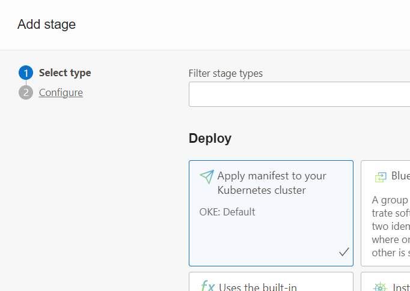
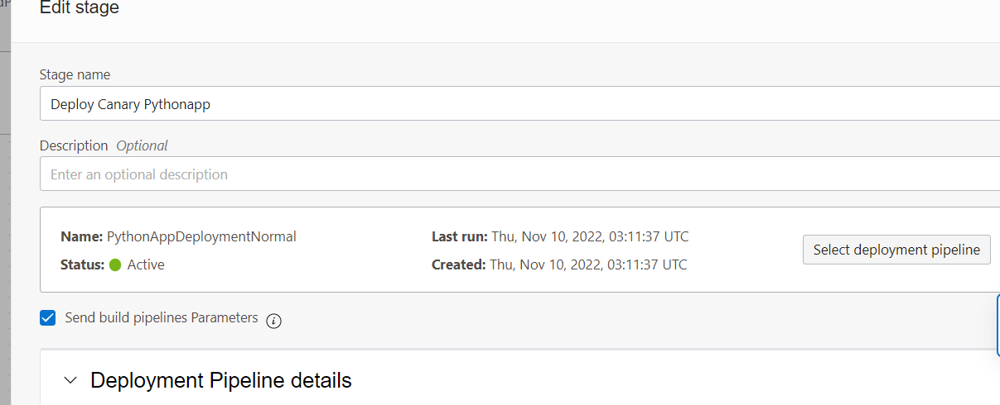

# OCI Tour Grand Prix MCR Sur, Qualy- Laboratorio para desplegar un microservicio en python en Oracle Kubernetes Engine (OKE) usando estrategias avanzadas de despliegue con OCI DevOps

[](https://img.shields.io/badge/license-UPL-green) [](https://sonarcloud.io/dashboard?id=oracle-devrel_python-oci-canary-oke-app)

Objetivos
---
- Crear un proyecto en OCI DevOps.
- Crear un repositorio de codigo Git con la aplicacion python en OCI DevOps.
- Crear un pipeline de construccion en OCI DevOps.
- Entregar los artefactos (container image y kube yaml) en OCI Container Registry y OCI Artifact.
- Crear 2 estrategias de despliegue de la aplicacion python (Canary y normal) en OCI DevOps.
- Aprovisionar un cluster OKE e instalar Nginx Ingress Controller.
- Desplegar la aplicacion python en OKE usando cada estrategia de despliegue.
- Validar y revertir los cambios.

Setup Lab
---
- Crear un compartment con el nombre de 'qualy.oke.devops'
- Crear un Grupo llamado 'devops-admins' y agregarse el grupo.
- Crear los permisos y accesos en IAM para ejecutar el lab
    - Crear un OCI IAM Dynamic Group llamado 'DevOpsDynamicGroup'
    ```
    ALL {resource.type = 'devopsbuildpipeline', resource.compartment.id = 'ocid1.compartment.oc1..xxx'}	
    ALL {resource.type = 'devopsrepository', resource.compartment.id = 'ocid1.compartment.oc1..xxx'}	
    ALL {resource.type = 'devopsdeploypipeline', resource.compartment.id = 'ocid1.compartment.oc1..xxx'}	
    ALL {resource.type = 'devopsconnection', resource.compartment.id = 'ocid1.compartment.oc1..xxx'}
    ```
    - Crear OCI IAM Policies
    ```
    Allow group devops-admins to manage all-resources in compartment qualy.oke.devops
    Allow dynamic-group DevOpsDynamicGroup to manage all-resources in compartment qualy.oke.devops
    ```
    > Para un entorno real o productivo se deberia acotar los permisos a recursos especificos con verbos y accesos especificos.

- Validar auth en OCI CLI desde el Cloud Shell
```
oci iam user get --user-id ocid1.user.oc1..xxx
```
- Validar git bash desde el Cloud Shell
```
git version
```
Lab
---
- ### Crea el cluster de OKE
    - Crear un nuevo OKE (Con public endpoint y public o private workers) - https://docs.oracle.com/en-us/iaas/Content/ContEng/home.htm . 
    
    

    Usa la opcion `Access cluster` para configurar tu acceso a `OKE` desde el Cloud Shell.
    

- ### Crea un topico en OCI Notification
    - Crear un nuevo topico en OCI Notification - https://docs.oracle.com/en-us/iaas/Content/Notification/Tasks/managingtopicsandsubscriptions.htm .
    

- ### Crea el proyecto en OCI DevOps
    - Crea un proyecto en OCI DevOps llamado `DevOps-GrandPrix2022` - https://docs.oracle.com/en-us/iaas/Content/devops/using/home.htm.
    

- ### Crea un repositorio en OCI Container Registry
    - Crea un OCI container registry en el compartment del Lab. https://docs.oracle.com/en-us/iaas/Content/Registry/home.htm
    

- ### Crea un repositorio en OCI Artifact Registry
    - Crea un OCI artifact registry . https://docs.oracle.com/en-us/iaas/Content/artifacts/home.htm
    

- ### Crea el OCI Vault y agregamos 2 secretos:
    - Crea el OCI Key Vault
    
    - Crea el Master Key en el OCI Key Vault
    
    - Crea los 2 secretos en el OCI Key Vault
    

    Secreto 1: `Name: OCIR_HOST_VAULT, Valor: iad.ocir.io` (si esta en la region de Ashburn)
    Secreto 2: `Name: OCIR_STORAGE_NAMESPACE_VAULT, Valor: <Container Registry namespace>`
    ```
- ### Descarga el codigo de la aplicacion python y subelo al repositorio en OCI Devops
    - Creamos un OCI Code repo donde guardaremos el codigo de la aplicacion python (sample).
    

    - Clona el repo publico de Github donde se encuentra publicado el sample y lo subimos al OCI Code repo que acabamos de crear.
        
    | En el comando de abajo se debe reemplazar los 3 parametros que empieza con <..>. 
        ```
        git clone https://github.com/czelabueno/python-oci-canary-oke-app.git
        cd python-oci-canary-oke-app
        git config user.email "<tu email>"
        git config user.name "<tu nombre>"
        git remote add oci-devops <Tu cadena de conexion del Clone via SSH que se copio>
        git remote
        git remote remove origin
        git pull --no-edit --allow-unrelated-histories oci-devops main
        git push oci-devops main
        ```
- ### Asociamos los artefactos a generar en OCI DevOps
    - Artifactos en OCI DevOps . - https://docs.oracle.com/en-us/iaas/Content/devops/using/artifacts.htm
    - Crea un artefacto tipo Docker `Docker image` para subir el artefacto en el `Delivery`. Asegúrese de usar la URL de su `container repo`, con el prefijo de `${OCIR_HOST}/${OCIR_STORAGE_NAMESPACE}` y `${BUILDRUN_HASH}` al final de la URL. Esto es para hacer que la versión de la imagen de la ventana acoplable sea dinámica.
    
    - Crea un artefacto de tipo `Kubernetes manifest`. Asegurate de agregar tu ruta de `artifact repo`y  la version como `${BUILDRUN_HASH}` .
    
    
- ### Crea el Build y Deployment Pipeline para el CI/CD en OCI DevOps
    - Crea un OCI devops build pipeline. https://docs.oracle.com/en-us/iaas/Content/devops/using/create_buildpipeline.htm
    
    - Agrega un `manage build` stage. https://docs.oracle.com/en-us/iaas/Content/devops/using/add_buildstage.htm
    
    
    - Selecciona el OCI DevOps Git repo `code repo /connection type /repo name` y ingresa la ruta del archivo `build_spec.yaml` que esta en la raiz del proyecto. Ejemplo: build_spec.yaml. Branch `main`. Build source name `BuildPythonApp`.
    - Agrega un `Deliver artifact` stage al Build pipeline. Clic en `+ Add Stage` sequencial.
    
    - Selecciona los 2 `artifacts` creados.
    
    - Asocia los nombres del `output artifact` del build_spec.yam
    
    - Asegurate que los nombres coincidan con lo especificado en el [build_spec.yaml.](build_spec.yaml) con los artefactos de salida.
    ```
    outputArtifacts:
    - name: oke_app_base
        type: DOCKER_IMAGE
        # this location tag doesn't effect the tag used to deliver the container image
        # to the Container Registry
        location: oke_app_base:latest

    - name: oke_deploy_manifest
        type: BINARY
        # this location tag doesn't effect the tag used to deliver the container image
        # to the Container Registry
        location: ${OCI_PRIMARY_SOURCE_DIR}/oci-oke-deployment.yaml
    ```
    - Creamos un nuevo devops environment de tipo `Kubernete Cluster` seleccionamos el OKE cluster creado en los pasos anteriores.- https://docs.oracle.com/en-us/iaas/Content/devops/using/create_oke_environment.htm
    
    

- ### Configuramos OKE para correr el escenario
    - Valida el acceso a OKE usando `kubectl get nodes` & `kubectl config view`.
    
    - Seguimos el procedimiento para instalar `Ingress Controller` - https://docs.oracle.com/en-us/iaas/Content/ContEng/Tasks/contengsettingupingresscontroller.htm
    - Crea un `clusterrolebinding` para dar accesos en OKE a tu user oci `ocid`. Reemplaza el parametro `--user=ocid1.user.oc1..xxx` en el cmd de abajo:
    ```
    kubectl create clusterrolebinding oke_cluster_role_<username> --clusterrole=cluster-admin --user=ocid1.user.oc1..xxx
    ```
    - Instala el Ingress controller,siempre usa la ultima version. - https://github.com/kubernetes/ingress-nginx#changelog

    ```
    kubectl apply -f https://raw.githubusercontent.com/kubernetes/ingress-nginx/controller-v1.1.2/deploy/static/provider/cloud/deploy.yaml
    ```
    - Crea y guarda el archivo cloud-generic.yaml conteniendo el siguiente codigo para definir el servicio del ingress-nginx ingress controller como un service de Load Balancer.
    ```
    kind: Service
    apiVersion: v1
    metadata:
    name: ingress-nginx
    namespace: ingress-nginx
    labels:
        app.kubernetes.io/name: ingress-nginx
        app.kubernetes.io/part-of: ingress-nginx
    spec:
    type: LoadBalancer
    selector:
        app.kubernetes.io/name: ingress-nginx
        app.kubernetes.io/part-of: ingress-nginx
    ports:
        - name: http
        port: 80
        targetPort: http
        - name: https
        port: 443
        targetPort: https

    ```
    - Graba el archivo yaml y ejecuta el siguiente comando:
    ```
    kubectl apply -f cloud-generic.yaml
    ```
    - Valida la instalación

    ```
    kubectl get svc -n ingress-nginx
    ```
    - El EXTERNAL-IP para el servicio del ingress controller ingress-nginx se muestra como "pendiente" hasta que el balanceador de carga se haya creado completamente en Oracle Cloud Infrastructure. Repita el comando kubectl get svc hasta que se muestre un EXTERNAL-IP para el ingreso de ingress-nginx. servicio de controlador. Tomará unos minutos, continua con los siguientes pasos.

    

    - Crea 2 nuevos namespaces para el despliegue de la aplicacion python.
    ```
    kubectl create ns nscanaryprd;kubectl create ns  nscanarystage;
    ```

- ### Modificamos el Build Pipeline para hacer el despliegue normal en OKE
    - Create a new devops deployment pipeline llamado `PythonAppDeploymentNormal`. - https://docs.oracle.com/en-us/iaas/Content/devops/using/deployment_pipelines.htm
    
    - Click `+ Add stage`. Seleccionar `Apply Manifest to your Kubernetes Cluster`. Click Next.
    
    - Ingrese los datos requeridos del Deployment Pipeline. 
        - En el campo "stage name" se sugiere ingresar `PythonAppDeploymentNormal`.
        - En el campo "Environment" seleccionar el OKE creado en los pasos anteriores.
        - Click en "Select Artifact". Check en el `python-app-deployment.yaml`.
        - En el campo "override kubernetes namespace" ingresar `nscanaryprd`, que es el namespace productivo de nuestra aplicacion.
        - En el campo "If validation fails..automatically rollback..." seleccionar `Yes`
    - Vaya a Build Pipeline y seleccione el "BuildPythonApp".
    - Agrega un `Trigger Deployment` stage al Build pipeline. Clic en `+ Add Stage` sequencial.
    
    - Ingresamos un nombre al stage y seleccionamos el Deployment Pipeline `PythonAppDeploymentNormal`. Marcamos check en el atributo `Send build pipelines parameters` para enviar todos las variables generados en los stages anteriores al Deployment Pipeline.
    
    - Click en `Start manual run` para ejecutar el Build Pipeline. Observar el progreso y el log de ejecucion.
    
    
    - Esperar hasta que todos los stages esten completados.
    
    - Validar el despliegue usando el EXTERNAL-IP del Ingress Addres via `curl` o browser.
        ```
        curl -k http://<Ingress Address>
        ```
        

        

    - Ahora simulemos un escenario real y una nueva entrega , modificamos el codigo de - `main.py` y cambiamos la version a `1.0` y correremos el build pipeline otra vez. Para modificar el codigo puedes usar el cmd `vim` o el `code editor` en OCI.

        ```
        from typing import Optional

        from fastapi import FastAPI

        import os

        app = FastAPI()


        @app.get("/")
        def read_root():
            version="1.0"
            namespace = os.getenv('POD_NAMESPACE', default = 'ns-red')
            return {"Message": "with Love from OCI Devops ","Version":version,"Namespace":namespace}
        ```

        - Actualizamos el cambio del codigo en el repositorio remoto.
        ```
        git add .
        git commit -m "cambio a version 1.0"
        git push oci-devops main
        ```
        Verifique que el git repositorio de la aplicacion python en OCI DevOps tenga el cambio listando los `Commits`.
        
    - Regresar al build pipeline y hacer click en `Start manual run`.
        
    
    - Ahora veremos como la entrega de una nueva version puede afectar la disponibilidad de nuestra aplicacion. Cuando el progreso del pipeline este en el stage `Deliver artifact` ejecutar el siguiente comando en el Cloud Shell.
        ```
        while true; do curl -Ls --resolve -k  http://<Ingress Address IP> | grep "Version"; done
        ```
    | Si en alguna respuesta la aplicacion responde un error, no se alarme. Estamos en buen camino :

- ### Modificamos el Build Pipeline para hacer el despliegue Canary en OKE
    Ahora veamos otro escenario real para empresas que despliegan aplicaciones altamente disponibles y que debe funcionar 24x7 o inclusive en multiples zonas horarias.
    Hoy en dia ya existen estrategias avanzadas de despliegue continuo conocidas como despliegues progresivos. Entre las mas populares tenemos a `Blue/Green` y `Canary` que nos permiten desplegar nuevas versiones y probarlas en `Produccion` (si leyo bien en producción) con usuarios reales sin reemplazar el anterior y son altamente confiables.

     - Create a new devops deployment pipeline llamado `PythonAppDeploymentCanary`. - https://docs.oracle.com/en-us/iaas/Content/devops/using/deployment_pipelines.htm
    
    - Click `+ Add stage`. Seleccionar `Canary Strategy`. Click Next.
    
    - Ingrese los datos requeridos del Deployment Pipeline.

        Configure
        - Deployment type seleccionamos `OKE`.
        - Stage name, ingresamos `CanaryDeployment`.
        - Environment, seleccionamos el OKE que se creo en los pasos anteriores.
            
        - Canary namespace, ingresa `nscanarystage`. Nota que es otro namespace.
        - Click en "Select Artifact". Check en el `python-app-deployment.yaml`.
            
            
        - NGINX Ingress name, ingresa `sample-oke-canary-app-ing`
            

        Validate Rollout
        - Como es una demo, mantenga los controles de Validación como `None` o puede conectarse con una función para validar la implementación y hacer clic en Next.
            

        Shift trafiic
        - Ingresa `Canary % of shift` como `25` para permitir abrir el 25 % del trafico en producción a la nueva version y click `Next`.
            

        Approval
        - Habilita el control de `Approval` para que la distribucion del trafico se mantenga 25/75 hasta que alguien valide que la entrega es estable y segura. Agrega `1` como numero de aprobadores.
            

        Production Canary
        - Para el stage final, ingresa el namespace productivo `nscanaryprd` y selecciona `Auto rollback`
            

        - Click en add para agregar todos los stages.
            

    - Regrese al Build Pipeline y modificamos el `Trigger Deployment`. Click en los 3 puntos-> View Details->Edit Stage.
    - Click en `Select deployment pipeline`
        

    - Seleccionamos el Deployment Pipeline Canary `PythonAppDeploymentCanary`. Guardamos los cambios.

    - Click en `Start manual run` para ejecutar el Build Pipeline. Observar el progreso y el log de ejecucion.
    
    - Esperar hasta que todos los stages esten completados.
    

    - Ahora cambiamos a `deployment pipeline` y click en el deployment que aun esta en `progress`.
    

    - El pipeline estara en estado pendiente en el `Approval` stage.

    - Click en los `3 puntos` y validar el `Control:Approval` stage.

    
    

    - Esperar que todos los stages esten completados.

    

    - Para validar la aplicación, necesitaríamos la dirección IP del Ingress Controller. Para obtener la misma, cambie a OCI Cloud Shell y ejecute los siguientes comandos y tome nota de la dirección IP de ingreso.

    ```
    for i in nscanaryprd nscanarystage; do echo " ....... NS $i ..........."; kubectl get po,ing -n $i; done
    ```

    

    - Ahora simulemos un escenario real, modificamos el codigo de - `main.py` y cambiamos la version a `2.0` y parte del mensaje a `..OCI Tour Grand Prix Lima 2022` y correremos el build pipeline otra vez. Para modificar el codigo puedes usar el cmd `vim` o el `code editor` en OCI.

        ```
        from typing import Optional

        from fastapi import FastAPI

        import os

        app = FastAPI()


        @app.get("/")
        def read_root():
            version="2.0"
            namespace = os.getenv('POD_NAMESPACE', default = 'ns-red')
            return {"Message": "with Love from OCI Tour Grand Prix Lima 2022 ","Version":version,"Namespace":namespace}
        ```

        - Actualizamos el cambio del codigo en el repositorio remoto.
        ```
        git add .
        git commit -m "cambio a version 2.0 con OCI Tour Grand Prix Lima 2022"
        git push oci-devops main
        ```
        Verifique que el git repositorio de la aplicacion python en OCI DevOps tenga el cambio listando los `Commits`.
        
    - Regresar al build pipeline y hacer click en `Start manual run`.
        

    - Esperamos hasta que llegue al stage `% Canary Shift` (NO aprobemos el cambio a las siguientes stage).

    - Validemos primero que la aplicacion responda el 25% del trafico con la nueva version usando el `OCI Cloud Shell`.

    ```
    for i in $(seq 1 100); do curl -Ls -H "redirect-to-canary" --resolve -k  http://<Ingress IP> | grep "Version"; done
    ```

    

    - Ahora que ya sabemos que la nueva version esta estable, abrimos el 100% del trafico a la nueva version realizando la aprobación para completar. Puedes volver a correr la prueba anterior.
    

    - Debido que debemos controlar totalmente nuestros cambios y si por alguna razon queremos regresar a la version anterior hacemos clic en los `3 puntos`, vamos a la ultimo stage y seleccionamos `manual rollback`.
    

    - Validamos los valores del deployment actual
    

    - Seleccionamos el deployment deseado (el deployment con la version sin los cambios del Grand Prix) e iniciamos el rollback.
    

    - Esperamos que el rollback se haya completado y validamos la aplicacion.
    
    


Voilà !!
    
Lee más
----

- OCI Devops - https://docs.oracle.com/en-us/iaas/Content/devops/using/home.htm.
- OCI Reference architectures  -  https://docs.oracle.com/solutions/
- OCI Devops samples - https://github.com/oracle-devrel/oci-devops-examples

Contributors
===========

- Author : [Carlos Zela Bueno](https://github.com/czelabueno)
- Last release : Octubre 2022


